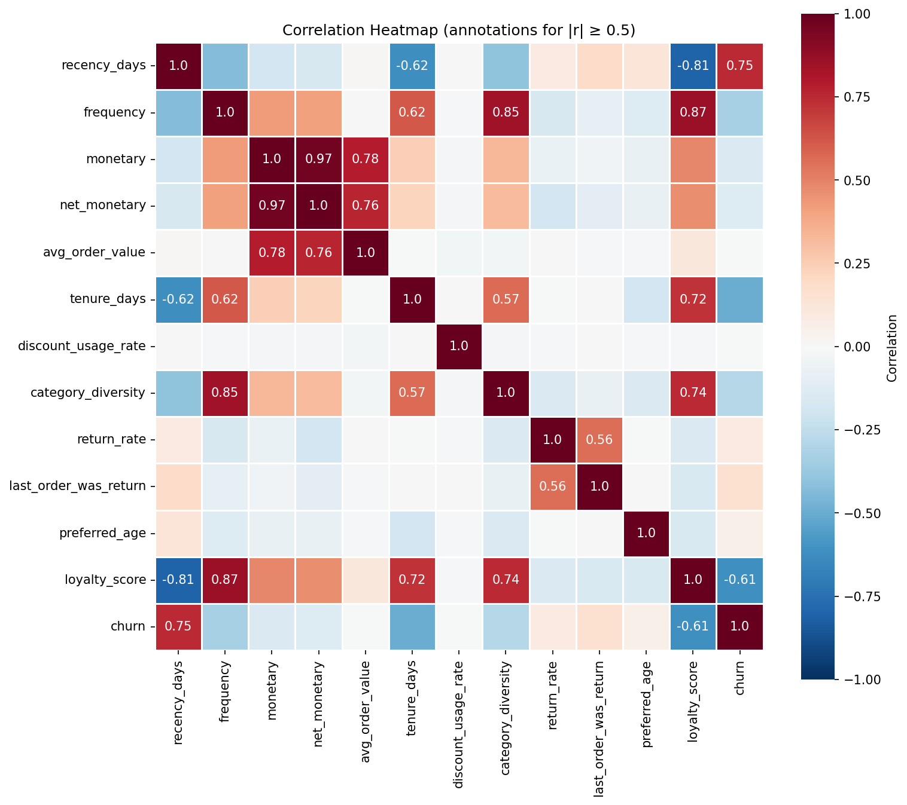
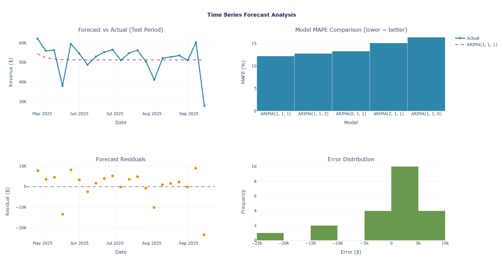
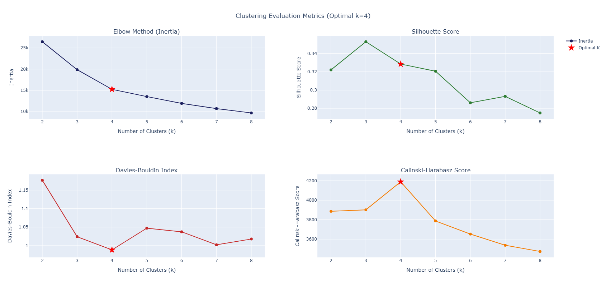
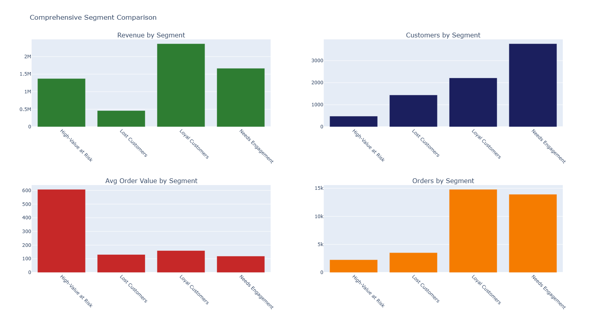
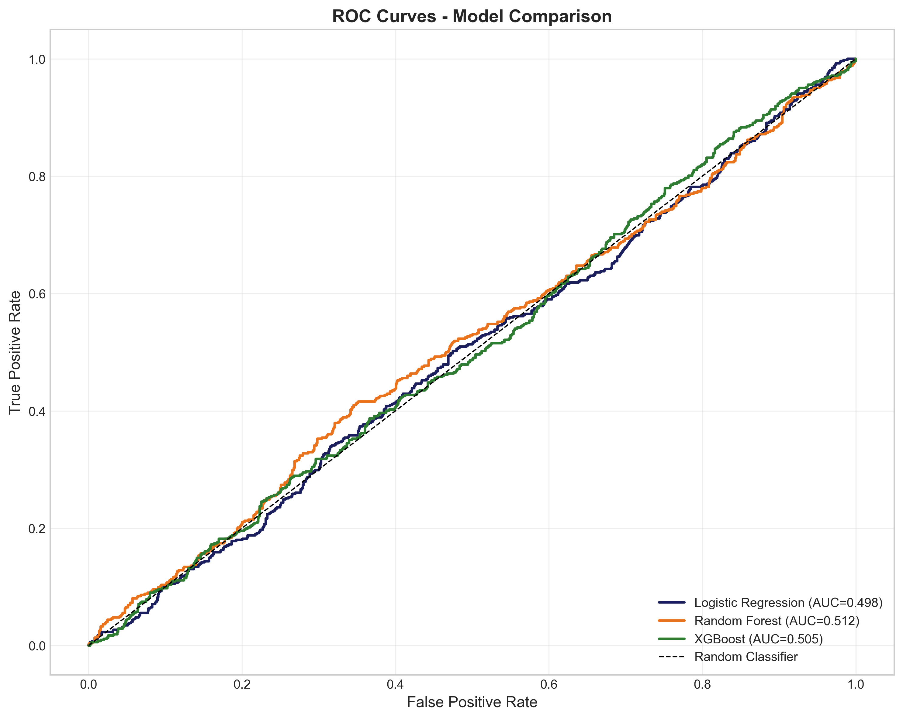
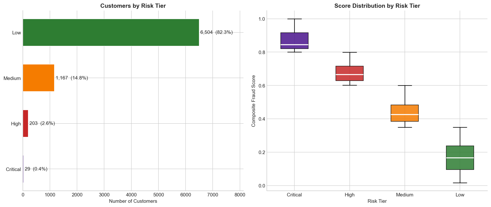
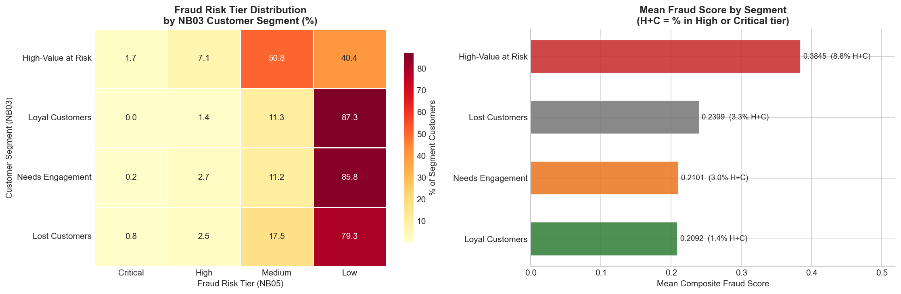
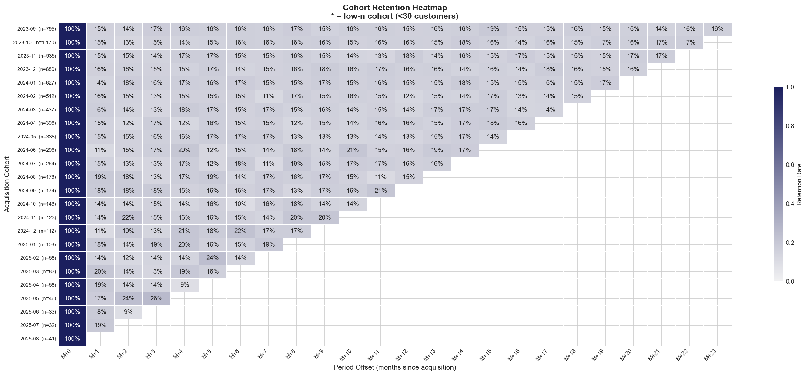

# E-Commerce Analytics Project

**34,500 transactions. 7,903 customers. Two years of data. One uncomfortable picture.**

Electronics alone generates 56.6% of revenue. More than eight in ten new customers never come back after their first purchase. The 480 highest-spending customers control nearly a quarter of all revenue — and a third of them have already gone quiet. Somewhere in the customer base, a small group is systematically returning products at high discounts and walking away with the margin.

This project is six notebooks that look at the same $5.87M business from six different angles. Each one answers a question the business actually needs answered. Together, they show not just what is happening, but why — and where to act first.

The dataset is synthetic, sourced from [Kaggle](https://www.kaggle.com/datasets/miadul/e-commerce-sales-transactions-dataset/data). Every number in this README has been verified directly against notebook cell output.

---

## The Six Questions

| Notebook | The Question |
|---|---|
| NB01 — Data Wrangling | What does the data actually say, and can we trust it? |
| NB02 — Sales Analysis | What is driving revenue, and where is the business exposed? |
| NB03 — Customer Segmentation | Who are the customers, really? |
| NB04 — Churn Prediction | Which customers are about to leave? |
| NB05 — Fraud Detection | Who is gaming the system? |
| NB06 — Cohort Retention | What is a new customer actually worth over time? |

---

## The Data

34,500 orders placed by 7,903 customers between September 2023 and September 2025, across seven product categories and five regions. Total gross revenue: $5,865,293. Return rate: 5.52%. Zero missing values, zero duplicates — the data arrives clean and stays clean through every notebook.

---

## How the Notebooks Connect

Each notebook validates its inputs before it touches them, and writes verified outputs that the next stage depends on. Nothing is hardcoded — every threshold, window, and model parameter lives in `config.yaml`.

```
NB01  ──►  enhanced_df.parquet  ──────────────────────────────────────┐
      └──►  rfm_df.parquet  ─────────────────────────────────────┐    │
                                                                 │    │
      NB02 (terminal) ◄────────────────────────────────── enhanced_df │
                                                                 │    │
      NB03 ◄──────────────────────────────────── rfm_df + enhanced_df │
           └──►  customer_segments.csv ──────────────────────┐        │
                                                             │        │
      NB04 ◄──────────────── enhanced_df + rfm_df + segments ┘        │
           └──►  customer_risk_segments.csv ──────────────┐           │
                                                          │           │
      NB05 ◄──── enhanced_df + rfm_df + segments + risk ──┘           │
                                                                      │
      NB06 (terminal) ◄──────── enhanced_df + rfm_df + segments ◄─────┘
```

---

## NB01 — What Does the Data Actually Say?

Before any analysis can mean anything, the data has to be trustworthy. NB01 runs the raw file through a four-stage cleaning pipeline — deduplication, type enforcement, business-rule checks, and automated assertions — and emerges with zero rows removed and zero missing values. A schema contract (using Pandera, a data validation library) catches any structural violations at ingestion. The pipeline halts if anything fails.

The enrichment step builds 17 customer-level behavioural features from the raw transactions — recency (days since last purchase), frequency (order count), monetary value (lifetime spend), return rate, discount usage, category diversity, and more. The resulting customer profile: average last purchase was 165 days ago, average order count is 4.1, average lifetime spend is $695.

**What the data reveals about the business before any modelling:**

Revenue is dangerously concentrated. Electronics generates 56.6% of total revenue ($3.3M of $5.87M). Add Home and Sports and you have 85.7% of revenue in three categories. This is a structural risk, not a rounding error — if Electronics demand softens or competition increases, the business has no cushion.

The typical customer spends much less than the average suggests. The mean order value is $170, but the median is $56.82 — a ~3× gap driven by a small number of high-value orders pulling the average up. Any analysis using the mean as a "typical customer" proxy will be misleading.

**Technical note for reproducibility:** all four transaction variables (order value, quantity, discount, shipping cost) fail the Shapiro-Wilk normality test (p < 0.001 in each case). In plain terms: the data is not bell-curve shaped, so standard tests like ANOVA and t-tests would produce unreliable results. All downstream statistical tests use non-parametric alternatives — methods that make no assumptions about the shape of the data.


*14 strong correlations (|r| > 0.5) identified. Key collinear pairs flagged and resolved before clustering: monetary/net_monetary (r = 0.967), frequency/loyalty_score (r = 0.865), category_diversity/frequency (r=0.85).*

---

## NB02 — What Is Driving Revenue?

Four business questions, four statistical tests, four actionable answers.

**Is revenue trending upward?** Year-over-year growth reads +14.67% for the most recent comparable window. But a Spearman correlation across all 24 months — a test that checks whether revenue is consistently moving in one direction over time — returns no significant trend (ρ = 0.090, p = 0.674). Month-to-month variance is high enough that no sustained direction is detectable. The YoY gain is real for that specific window. It is not evidence of a durable growth trajectory.

**Are category revenue differences real?** Yes — and large. A Kruskal-Wallis test (a non-parametric equivalent of ANOVA that compares distributions across multiple groups) confirms the differences are not noise: H = 18,977, effect size ε² = 0.550. By convention, anything above 0.14 is a large effect. Category is the single strongest structural driver of revenue in the dataset.

**Do regional differences in revenue matter?** No. The South region leads in raw revenue ($1.3M), but a Kruskal-Wallis test finds no significant difference in order value across regions (p = 0.157). South leads because it has the most transactions (22% of total) — not because its customers spend more per order. Allocating marketing or logistics budgets based on regional revenue rankings is not statistically defensible.

**Does discounting hurt the business?** It depends on the window. Per transaction, discounts reduce order value by $7.03 (−11.7%). But per customer over their lifetime, discount buyers place twice as many orders (median 4 vs 2) and generate 75.1% more revenue ($787 vs $450). The per-transaction loss is real and small. The lifetime gain is real and large. Net impact is positive — discounting is revenue-accretive at moderate tiers.

**Revenue forecast:** an ARIMA model (a time-series forecasting method that accounts for momentum and moving-average effects) was fitted across six configurations. The best-performing version achieves a mean absolute percentage error of 12.21% on held-out test data — accurate enough for strategic and budget planning. Weekly average revenue: $52,158. A rolling 13-week window shows a −4.8% recent softening compared to the prior equal window — a near-term signal worth watching.


*ARIMA(1,1,1) selected from 6 configurations — lowest MAPE (12.21%) and lowest AIC simultaneously. Residuals are centred around zero with no systematic pattern.*

---

## NB03 — Who Are the Customers?

RFM analysis (Recency, Frequency, Monetary value — a standard framework for describing customer behaviour along three axes) groups 7,903 customers into four segments using k-means clustering. The number of segments (four) was chosen by testing two through eight groups across four independent metrics and taking the result with the most votes. Four won three-to-one.

Bootstrap stability testing — running the clustering 50 times on random 80% subsamples and measuring how consistently customers end up in the same groups — produces a mean ARI (Adjusted Rand Index, a measure of clustering agreement) of 0.939. Near-perfect stability. The segments are not a lucky initialisation result.

**The four segments:**

**Loyal Customers (2,215 customers, 28%)** are the revenue engine. They account for 41.1% of net revenue despite being less than a third of the customer base. Mean recency 76 days (median: 56 days), average 6.4 orders, average lifetime spend of $1,015. More than half are currently active.

**Needs Engagement (3,766 customers, 48%)** is the largest group and the most mixed. They contribute 26.9% of revenue. Recent enough to still be reachable (mean recency 124 days, median: 114 days), but low frequency (3.5 orders on average) and a fragmented churn profile — roughly a quarter active, a quarter churned, a quarter at risk, a quarter inactive. This is the swing segment.

**Lost Customers (1,442 customers, 18%)** are gone. Mean recency 415 days (median: 392 days), average 2.2 orders, 100% churned by the time-based churn definition. They made a handful of purchases over a year ago and left. Revenue recovery probability is low — the question is whether the cost of a win-back campaign is worth the expected return.

**High-Value at Risk (480 customers, 6%)** is the most commercially critical segment in the entire project. They generate 24.7% of net revenue — nearly $1.4M — off an average spend of $2,815 per customer and an average order value of $707 (approximately 4× the portfolio mean). Mean recency of 153 days (median: 116 days) means most are still within reach — which makes the churn picture more alarming, not less: 32.7% are already churned and only 28.1% are currently active despite not being far removed from their last purchase. This is the segment where losing customers is most expensive and winning them back is most valuable.


*Four independent metrics tested across k=2–8. k=4 wins 3 of 4 votes (Davies-Bouldin, Calinski-Harabasz, Elbow). Silhouette's preference for k=3 was overridden — at k=3, the High-Value at Risk segment is absorbed into a larger group, erasing the most commercially significant signal in the dataset.*


*The key point is the imbalance: High-Value at Risk customers make up only 6.1% of all customers, but they bring in 24.7% of total revenue — despite being less than a quarter the size of the Loyal Customers segment (28% of customers, 41.1% of revenue). On average, they spend $707 per order, which is 4–6 times more than customers in other segments.*

---

## NB04 — Which Customers Are About to Leave?

A supervised machine learning model attempts to predict churn using a forward-looking design: features are computed from transaction history before a cutoff date, and the label (churned or not) is assigned based on whether the customer placed any orders in the 180 days after that cutoff. This eliminates look-ahead bias — the model never sees future information during training.

Three classifiers were trained and compared. Logistic Regression wins on F1-score (a metric that balances false positives and false negatives):

| Model | F1 Score | ROC-AUC |
|---|---|---|
| Logistic Regression | 0.392 | 0.498 |
| XGBoost | 0.372 | 0.505 |
| Random Forest | 0.357 | 0.512 |

ROC-AUC of 0.498 means the model separates churners from non-churners no better than a coin flip. All five configured performance thresholds fail. This is documented honestly as a **data ceiling, not a methodology failure** — on synthetically generated data, the churn label is not derivable from behavioural features because no real behavioural signal drives the label. The temporal isolation design, the collinearity testing (VIF — a measure of how redundant features are with each other), and the train-only preprocessing are all correct. The data simply cannot support supervised churn prediction.

The model does, however, surface one consistent signal: `last_order_was_return` and `return_rate` together account for 52.7% of model decisions. Return behaviour is the strongest predictor of churn — a finding that reappears in NB05 with different methods and reaches the same conclusion.


*All three models hug the diagonal (random classifier baseline). This is the expected result on synthetic data — documented honestly rather than obscured. The architecture is correct; the data ceiling is the constraint.*

**The validated substitute:** when NB03's segments are cross-checked against NB04's time-based churn labels, they produce a clean monotonic gradient:

| Segment | Actual Churn Rate |
|---|---|
| Lost Customers | 94.3% |
| High-Value at Risk | 32.3% |
| Needs Engagement | 25.8% |
| Loyal Customers | 8.2% |

Segment membership outperforms probability scores as a churn signal. The production recommendation is to use NB03 labels to prioritise intervention and NB04's three-tier stratification (High / Medium / Low risk) for campaign sizing.

---

## NB05 — Who Is Gaming the System?

No fraud labels exist in this dataset, so this notebook uses three independent unsupervised methods — rule-based scoring, Isolation Forest (a tree-based anomaly detector that identifies customers needing unusually few decision steps to isolate), and Local Outlier Factor (which flags customers who are sparse relative to their local peer group) — and blends them into a single composite risk score. Scores reflect elevated behavioural risk, not confirmed fraud.

The blend: rules at 40%, Isolation Forest at 30%, Local Outlier Factor at 30%. The two anomaly models agree on binary flags only 92.1% of the time (Cohen's Kappa = 0.166 — slight agreement, by convention). They detect different things and are intended to be complementary.

**Risk tier breakdown across all 7,903 customers:**

| Tier | Customers | Share | What It Means |
|---|---|---|---|
| 🔴 Critical | 29 | 0.4% | Immediate manual review |
| 🟠 High | 203 | 2.6% | Priority review queue |
| 🟡 Medium | 1,167 | 14.8% | Silent enhanced monitoring |
| 🟢 Low | 6,504 | 82.3% | Normal operations |

**The dominant signature:** 27 of the 29 Critical-tier customers are Return Abusers — return fraud combined with high-discount-return behaviour is the definitive fingerprint of the most severe risk tier. The strongest statistical correlation with the overall fraud score is `return_rate` (Spearman ρ = 0.595), consistent with NB04's feature importance finding.

**Financial exposure (232 High and Critical customers):**  
Total deduplicated exposure: $96,822 — primarily return exposure ($87,512). 339 overlapping orders (returned and discounted, or returned and negative-margin) were resolved to exactly one bucket to prevent double-counting.

**The two compounded-risk cohorts that warrant immediate attention:**

- **High-Value at Risk customers in the High or Critical fraud tier: 42 customers.** The highest average spend in the portfolio meeting the highest behavioural risk threshold. Revenue concentration and fraud risk are co-located in the same 42 people.
- **High churn risk combined with High or Critical fraud: 109 customers.** These customers are at risk of leaving — and may be extracting value on their way out.

**Margin exploitation calibration resolved:** the Margin Exploitation threshold was raised from 30% to 50% — down from 22.5% of the customer base (1,777 customers) to 9.9% (786 customers). At 50%, the rule now captures customers where the majority of their orders carry negative margin, a genuinely anomalous pattern. The 72% Low-tier false-positive problem documented at the 30% threshold is eliminated. No Combined Attack customers remain — the multi-typology co-occurrences at the prior threshold were driven by the loose margin rule.


*82.3% of customers score Low risk. The sharp drop to Medium (14.8%) → High (2.6%) → Critical (0.4%) reflects a well-calibrated scoring system — not a model that flags everyone. Score distributions by tier are cleanly separated with no overlap between Critical and Low.*


*The cross-pipeline finding: High-Value at Risk customers have 8.8% in High or Critical tier versus 1.4% for Loyal Customers. The segment most valuable to the business is also the most behaviourally anomalous — fraud risk and churn risk are co-located in the same cohort.*

---

## NB06 — What Is a New Customer Actually Worth?

Cohort analysis tracks what happens to customers month by month after they first buy. Twenty-five acquisition cohorts, 24 observation periods, 7,877 customers.

**The headline finding is stark:** M+1 retention — the share of customers who make a second purchase within the first month — is 15.2%. The healthy benchmark is 25%. That is 84.8% of new customers not returning after their first order, exceeding the 70% critical dropout threshold.

After that cliff, retention stabilises. The band from M+2 through M+23 is 14.9% to 16.6% — tight, flat, and sustained. There is no secondary drop at three months, six months, or any later period. **The entire retention problem lives at the first-month boundary.** The loyalty mechanics after that point work. The onboarding does not.


*25 acquisition cohorts × 24 observation periods. The M+1 column is uniformly ~15% across every cohort row — no single cohort stands out, confirming the problem is structural, not campaign- or season-specific. The flat band from M+2 onward is equally striking: retention stabilises immediately after the first dropout cliff and never recovers.*

A Kruskal-Wallis test comparing M+1 retention across all 24 acquisition cohorts (H = 22.0, p = 0.460) finds no significant differences between them. Every cohort has the same problem at the same magnitude — it is not attributable to a bad campaign, a specific channel, or a particular season. It is structural. One fix applies universally.

**Revenue churn tracks customer churn almost exactly.** At every period, the spread between revenue retention and customer retention stays within ±2.0% (average −0.2%). High-value customers are not leaving faster or slower than average customers. The business is losing volume and value in equal measure.

**Lifetime value compounds genuinely:**

| Window | LTV per Customer Acquired |
|---|---|
| 1 month | $208 |
| 3 months | $273 |
| 6 months | $362 |
| 12 months | $525 |

The 12-month LTV is 1.92× the 3-month LTV — confirming that customers who stay are making real repeat purchases, not just one-time splurges.

**The HVAR LTV premium deserves its own line.** High-Value at Risk customers generate a 12-month LTV of $2,237 per acquired customer — 3.45× the Loyal Customer LTV of $648. They have lower retention rates at every single period. They still generate 3.45× more lifetime value because their per-order spend is so high that even infrequent returns compound into a disproportionate result. Losing one HVAR customer costs the equivalent of 3.45 Loyal customers in forgone LTV.

**What a 5-percentage-point improvement in M+1 retention would mean:**  
+$39,384 in additional annual revenue at current acquisition volume. +10pp delivers $78,768. These estimates are conservative — they do not account for compounding across the LTV window.

---

## What Emerges Across All Six Notebooks

Reading the notebooks individually shows what each analytical lens can see. Reading them together shows what none of them can see alone.

**Returns are the connective tissue of risk across the entire pipeline.** NB04 finds that return behaviour accounts for 52.7% of churn model decisions. NB05 finds that `return_rate` has the strongest correlation with the fraud composite score (ρ = 0.595). The same customers who are most likely to leave are disproportionately represented among those gaming the return and discount system. A post-return outreach programme — a targeted intervention triggered immediately after a return is processed — has simultaneous leverage on churn prevention and fraud containment. No other single intervention touches both pipelines.

**The High-Value at Risk segment is the fulcrum of the entire business.** Six percent of customers. Approximately twenty-five percent of revenue. Second-highest churn rate among the four segments (32.3%, behind only the already-gone Lost Customers at 94.3%). Highest average fraud score. Lowest retention rate among high-LTV tiers. A 3.45× LTV premium over the next-best group. Every risk identified in this project is concentrated most severely in these 480 customers — and every potential upside is largest here too. This is where the business is most fragile and most improvable simultaneously.

**The discount programme is working and creating surface at the same time.** NB02 confirms that discount customers generate 75.1% more lifetime revenue per customer. NB05 confirms that discount exploitation and high-discount-return behaviour are among the 16 fraud features, and that 27 of the 29 Critical-tier customers are Return Abusers with return-plus-high-discount-return as the dominant Critical-tier signature. The commercial benefit and the abuse risk are structural features of the same programme. Discount design needs to account for both — tiered eligibility, purchase-history requirements, or return-rate caps on discount access would preserve the engagement benefit while reducing the exploitation surface.

**Supervised machine learning cannot predict churn on this dataset, but unsupervised segmentation can.** The churn model (ROC-AUC 0.498) is outperformed by a four-group clustering that produces a clean 94% → 32% → 26% → 8% churn gradient across segments. This is a synthetic data limitation, not an architecture one. When real transaction data is available — with genuine behavioural signal driving the churn label — the NB04 temporal design, VIF gating, and train-only preprocessing are the right foundation. On synthetic data, segment membership is the production-grade proxy.

**The retention problem has one cause and one fix.** Eighty-five percent of new customers not returning after their first purchase. No secondary dropout cliff. No cohort-specific variation (p = 0.460). No differential by customer value tier. One structural onboarding gap, consistent across all 25 cohorts, where a single well-designed post-purchase sequence — triggered within seven days of first order, incentivising a second purchase — would apply uniformly across the entire business.

---

## Where to Act First

Three interventions emerge from the analysis with the clearest evidence base and the highest expected return:

**1. Post-purchase onboarding sequence.** The evidence from NB06 is unambiguous: 84.8% M+1 dropout, no cohort-specific variation, no secondary cliff. Every new customer is exposed to the same gap. A/B test a second-purchase incentive (10% off next order, personalised category recommendation) triggered within 7 days. A +5pp improvement in M+1 retention generates $39,384 in incremental annual revenue at current acquisition volume — before accounting for downstream LTV compounding.

**2. High-Value at Risk retention programme.** Forty-two customers sit in both the HVAR segment and the High or Critical fraud tier — the highest combined-risk cohort in the dataset. Beyond them, 278 HVAR customers are Medium or High fraud risk, and 157 are already classified as churned. The LTV at stake per customer ($2,237 at 12 months) means even a modest retention improvement here outweighs broad-base programmes at scale. Personalised outreach, dedicated account support, and proactive post-return contact for this segment have the highest marginal return of any intervention in this analysis.

**3. Return-triggered fraud monitoring.** The return signal appears in both the churn model and the fraud composite score independently, and with the strongest individual effect in each. Automated flags on high-discount returns — specifically the return-after-maximum-discount pattern that characterises 27 of the 29 Critical-tier customers — would reduce financial exposure ($96,822 identified in the 232 High and Critical customers) while simultaneously flagging at-risk customers for retention outreach. This is the single intervention with cross-pipeline leverage.

---

## Repository Structure

```
ecommerce-analytics-project/
├── assets/
│   ├── nb01_correlation_heatmap.png
│   ├── nb02_forecast_analysis.png
│   ├── nb03_cluster_selection.png
│   ├── nb03_segment_comparison.png
│   ├── nb04_roc_comparison.png
│   ├── nb05_risk_tier_breakdown.png
│   ├── nb05_segment_fraud_crosstab.png
│   └── nb06_cohort_heatmap.png
├── data/
│   ├── raw/
│   │   └── ecommerce_sales_34500.csv
│   └── processed/
│       ├── enhanced_df.parquet           # NB01 → 34,500 transactions, 17 features
│       ├── rfm_df.parquet                # NB01 → 7,903 customers, 17 features
│       ├── customer_segments.csv         # NB03 → segment labels + churn risk flags
│       ├── churn_predictions.csv         # NB04 → 7,671 customers + risk tiers
│       ├── customer_risk_segments.csv    # NB04 → segments × risk tiers cross-ref
│       ├── fraud_risk_profile.parquet    # NB05 → 7,903 customers, 26 features
│       ├── fraud_risk_summary.csv        # NB05 → 232 High/Critical customers only
│       ├── cohort_retention.parquet      # NB06 → 24 cohorts × 24 periods
│       ├── cohort_ltv.parquet            # NB06 → cumulative LTV per cohort
│       ├── cohort_summary.parquet        # NB06 → recommended dashboard input
│       └── cohort_segment_ltv.parquet    # NB06 → LTV by segment × time window
├── models/
│   ├── churn_model.pkl                   # Logistic Regression (best F1 = 0.392)
│   ├── scaler.pkl                        # Train-only StandardScaler
│   ├── feature_columns.txt               # 7 COMPOSITE feature names
│   └── model_performance.json
├── notebooks/
│   ├── 01_data_engineering_eda.ipynb
│   ├── 02_sales_analysis_arima_forecasting.ipynb
│   ├── 03_customer_segmentation.ipynb
│   ├── 04_churn_prediction.ipynb
│   ├── 05_fraud_detection.ipynb
│   └── 06_cohort_retention_lifecycle.ipynb
├── outputs/
│   └── figures/
│       ├── notebook2_fig/    # 13 interactive HTML charts
│       ├── notebook3_fig/    # 5 interactive HTML charts
│       ├── notebook4_fig/    # 4 model evaluation charts
│       ├── notebook5_fig/    # 10+ fraud profiling charts
│       └── notebook6_fig/    # 11 retention and LTV charts
├── src/
│   ├── n1a_utils.py                    # Shared utilities — NB01
│   ├── n1b_data_loader.py              # Data ingestion — NB01
│   ├── n1b_missing_data_analysis.py    # Missing data audit — NB01
│   ├── n1c_preprocessing.py            # Cleaning pipeline — NB01
│   ├── n1d_rfm_features.py             # RFM feature engineering — NB01
│   ├── n1e_viz_exploration_utils.py    # EDA visualisation helpers — NB01
│   ├── n1f_sanity_check.py             # Data quality gate — NB01
│   ├── n1g_data_saver.py               # Output persistence — NB01
│   ├── n1h_enhanced_analysis.py        # Enhanced analysis — NB01
│   ├── n2a_utils.py ... n2i_*          # Sales analysis modules — NB02
│   ├── n3a_utils.py ... n3k_*          # Segmentation modules — NB03
│   ├── n4a_utils.py ... n4i_*          # Churn prediction modules — NB04
│   ├── n5a_utils.py ... n5h_*          # Fraud detection modules — NB05
│   ├── n6_utils.py ... n6j_*           # Cohort retention modules — NB06
│   └── schema_validation.py            # Shared schema validation
├── tests/
│   ├── pytest.ini
│   ├── requirements-test.txt
│   ├── test_n1a_utils.py
│   ├── test_n1b_data_loader.py
│   ├── test_n1c_preprocessing.py
│   ├── test_n1d_rfm_features.py
│   ├── test_n1f_sanity_check_wrapper.py
│   ├── test_n1g_data_saver.py
│   └── test_n1h_enhanced_analysis.py
└── config.yaml               # All thresholds, hyperparameters, business rules
```

---

## Setup

```bash
git clone https://github.com/jazzlanders0111-hash/ecommerce-analytics-project.git
cd ecommerce-analytics-project

# Option A — conda (recommended)
conda env create -f environment.yml
conda activate ecommerce-analytics

# Option B — pip
pip install -r requirements.txt
```

Download the dataset from Kaggle ([link](https://www.kaggle.com/datasets/miadul/e-commerce-sales-transactions-dataset/data)) and place it in `data/raw/`. All processed outputs in `data/processed/` are generated by the notebooks — they are not committed to the repository.

---

## Reproducing the Pipeline

Run notebooks in order: `01 → 02` (independent branch), `01 → 03 → 04 → 05`, `01 → 03 → 06`. Each notebook validates its inputs before producing output — the pipeline halts on any integrity failure rather than silently propagating a corrupted handoff. `random_state = 42` is seeded globally in every notebook. Results are fully reproducible.


## Limitations

**The dataset is synthetic.** Real transaction data carries latent churn signals, genuine fraud patterns, and organic seasonality that synthetic generation cannot replicate. The clearest consequence is the NB04 churn model ceiling (ROC-AUC 0.498). All retention benchmarks, fraud thresholds, and model performance figures should be recalibrated against real data before any operational use.

**Fraud detection has no ground truth.** Scores reflect elevated behavioural risk. The 5% contamination assumption driving the anomaly models is a calibration choice, not an empirical fraud rate. Rule thresholds are calibrated starting points — validate against domain expertise before operational use. The Margin Exploitation threshold was raised from 30% to 50% during this project cycle, reducing coverage from 22.5% of the customer base to 9.9% (786 customers) — a materially more credible population for investigation.

**No acquisition cost data.** LTV is computed but CAC payback period cannot be. The `cohort_ltv.parquet` output is designed to accept acquisition cost data when it becomes available.

**Electronics concentration is a project-wide caveat.** At 56.6% revenue share, a meaningful shift in Electronics demand changes the conclusions of every notebook. The concentration is flagged in NB01 and is the risk context for every strategic recommendation made downstream.

---

*Six notebooks. One business. Run date: 2026-02-27.*
